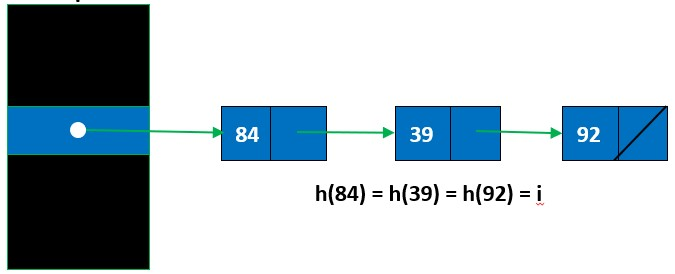

# Hash table summary

## Hash functions

### Modulo arithmetic

hash(Key) = Key mod HASHTABLESIZE

### Folding

hash(Key) = (Key[0:3]+Key[0:6]) mod HASHTABLESIZE

### Mid square

Square the middle part of the key and then apply the hash arithmetic to obtain hash

## Hash collision

To handle hash collision when the same key is mapped to the same hash address, we can make use of the methods listed below.

## Chaining

m = Number of slots in hash table  
n = Number of keys to be inserted in hash table  
Load factor α = n/m, the average number of nodes in each linked list  
  

### Time complexity analysis (Close addressing)

Worse-case scenario

- all elements hashed to same address
- unsuccessful search requires N iterations
- successful requires on average O(N)

Average case

- Expected time to search = O(1 + α)  
- Expected time to delete = O(1 + α)  
- Time to insert = O(1)  
- Time complexity of search insert and delete is O(1) if α is O(1)  

## Open addressing

Insert, Search operation involve probing till element inserted or found  
Delete operation marks element, mark identifies element as deleted and signals possible insertion point  
α will never be greater than 1, since each slot can only have 1 element

### Linear probing

(hash(input) + i) % HASHTABLESIZE  
Performs hash function to find index, increment index by 1 till inserted  

Primary clustering - elements cluster, insert and search increasingly linear  
Secondary clustering - same collision chain causing same sequence of probing  

### Quadratic probing

$(hash(input)+i \times i^2 ) \bmod HASHTABLESIZE$

### Randomizer

srand(time(NULL))  

### Double hasing

(hash(input) + i * hash(input)) % HASHTABLESIZE

### Time complexity analysis (Open addressing)

Linear probing  
if a search is successful: $\frac{1}{2}(1+\frac{1}{1−\alpha})$  
if a search is unsuccessful: $\frac{1}{2}(1+\frac{1}{1−\alpha}^2)$  

## Summarise

Closed addressing: O(α) on average  
Open addressing: O(function(1/(1-α))) on average

---

Copyright © 2022 Ng Tze Kean, Github @HiIAmTzeKean
